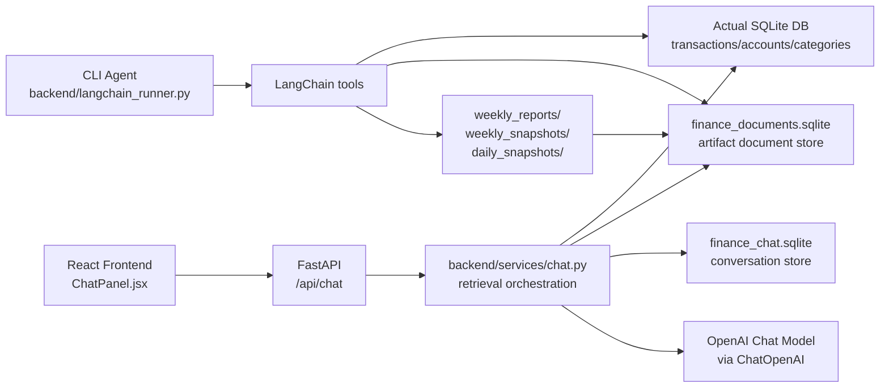

# AI Architecture Summary

This document describes the current AI functionality in the finance agent repository as of April 2026.

The codebase currently has two distinct AI paths:

- a product-facing chat copilot used by the React frontend and served by FastAPI
- a legacy/companion LangChain CLI agent used for report generation, snapshots, and explicit tool calling

They share the same finance data layer and some retrieval helpers, but they are not the same runtime architecture.

## High-Level View

## System Split

### 1. Frontend Chat Copilot

The product chat experience is the path behind the dashboard AI panel. The main files are:

- [frontend/src/components/ChatPanel.jsx](/Users/ketia/Documents/Actual/My-Finances-b5b9544/finance-agent/frontend/src/components/ChatPanel.jsx:1)
- [backend/app.py](/Users/ketia/Documents/Actual/My-Finances-b5b9544/finance-agent/backend/app.py:1)
- [backend/services/chat.py](/Users/ketia/Documents/Actual/My-Finances-b5b9544/finance-agent/backend/services/chat.py:1)
- [backend/services/conversations.py](/Users/ketia/Documents/Actual/My-Finances-b5b9544/finance-agent/backend/services/conversations.py:1)

This path is not a tool-calling agent in the strict LangChain sense. It is a retrieval-and-prompt assembly service that:

- receives a user message, recent history, and UI context
- computes finance facts from live transaction data
- optionally adds historical retrieval results from saved artifacts
- asks an OpenAI chat model to return structured JSON
- persists the conversation thread in SQLite

### 2. CLI LangChain Agent

The CLI flow lives in:

- [backend/langchain_runner.py](/Users/ketia/Documents/Actual/My-Finances-b5b9544/finance-agent/backend/langchain_runner.py:1)

This path is a real tool-using agent. It defines a toolset around:

- date-window management
- weekly data loading
- rollup generation
- week-over-week comparison
- snapshot/report persistence
- historical artifact search

This agent is better suited to report generation and file-producing workflows than the current dashboard chat endpoint.

## Frontend Chat Architecture

### Frontend Responsibilities

The frontend chat panel in [ChatPanel.jsx](/Users/ketia/Documents/Actual/My-Finances-b5b9544/finance-agent/frontend/src/components/ChatPanel.jsx:1) does five important things:

1. It derives chat context from the selected card and current dashboard window.
2. It restores the prior conversation for the same account from local storage plus the backend conversation API.
3. It sends the current message, prior message history, and context to `/api/chat`.
4. It renders markdown responses, action chips, and history.
5. It keeps chat threads scoped to the selected account.

The context payload currently includes:

- selected tab
- account id and name
- displayed card label
- analysis window start/end
- focus category
- focus payee

This gives the backend enough information to answer questions in a card-aware way even when the user message is short.

### API Surface

The FastAPI app in [backend/app.py](/Users/ketia/Documents/Actual/My-Finances-b5b9544/finance-agent/backend/app.py:1) exposes:

- `POST /api/chat`
- `GET /api/chat/conversations`
- `GET /api/chat/conversations/{conversation_id}`
- `DELETE /api/chat/conversations/{conversation_id}`

These endpoints make the product chat experience stateful without forcing the frontend to keep the full thread in memory forever.

### Backend Chat Lifecycle

The main request handler is `generate_chat_response()` in [backend/services/chat.py](/Users/ketia/Documents/Actual/My-Finances-b5b9544/finance-agent/backend/services/chat.py:250).

The request lifecycle is:

1. Accept `message`, optional `conversation_id`, recent `history`, and `context`.
2. Build a retrieval pack with `_build_retrieval_pack()`.
3. Append the user message to the conversation store.
4. If `OPENAI_API_KEY` is missing, return a deterministic fallback summary.
5. Otherwise, send a system prompt plus a JSON payload to `ChatOpenAI`.
6. Parse model output as JSON with keys `content`, `sources`, and `actions`.
7. Save the assistant message to the conversation store.
8. Return structured response data to the frontend.

### Retrieval Pack Design

The retrieval pack is the core of the current product AI behavior.

It combines:

- live current-window transaction data
- prior-week comparison
- category history lookups
- similar week retrieval
- anomaly lookups
- historical report search
- generic artifact search

The helper `_build_retrieval_pack()` currently uses:

- [backend.utils.db.get_transactions_in_date_range](/Users/ketia/Documents/Actual/My-Finances-b5b9544/finance-agent/backend/utils/db.py:51)
- [backend.services.insights.get_week_rollups](/Users/ketia/Documents/Actual/My-Finances-b5b9544/finance-agent/backend/services/insights.py:71)
- [backend.services.insights.compare_week_over_week](/Users/ketia/Documents/Actual/My-Finances-b5b9544/finance-agent/backend/services/insights.py:157)
- document retrieval functions from [backend/services/documents.py](/Users/ketia/Documents/Actual/My-Finances-b5b9544/finance-agent/backend/services/documents.py:1)

Retrieval strategy selection is heuristic, not agentic. For example:

- words like `similar` or `compare` can trigger similar-week retrieval
- words like `anomal`, `spike`, `unusual`, `overspend`, or `large` can trigger anomaly retrieval
- a focused category in the UI context can trigger category history retrieval

This means the product chat behaves more like a retrieval orchestrator than an autonomous reasoning agent.

### Prompting Model Contract

The product chat uses `ChatOpenAI` directly with a simple contract:

- the system prompt asks for Markdown grounded in facts
- the model must return valid JSON only
- the expected keys are `content`, `sources`, and `actions`

This is intentionally narrow and easier to render in the UI than a free-form tool-calling loop.

### Conversation Persistence

Conversation persistence lives in [backend/services/conversations.py](/Users/ketia/Documents/Actual/My-Finances-b5b9544/finance-agent/backend/services/conversations.py:1) and stores data in `finance_chat.sqlite`.

There are two tables:

- `chat_conversations`
- `chat_messages`

The stored metadata includes:

- account id
- account name
- card label
- context JSON
- created/updated timestamps

This lets the frontend restore per-account threads and show recent conversation history.

## Historical Retrieval Layer

The document layer lives in [backend/services/documents.py](/Users/ketia/Documents/Actual/My-Finances-b5b9544/finance-agent/backend/services/documents.py:1).

It converts generated artifacts into searchable normalized records stored in `finance_documents.sqlite`.

Current source artifact types:

- `daily_snapshots/*.json`
- `weekly_snapshots/*.json`
- `weekly_reports/*.md`

Stored document fields include:

- type
- source path
- title/content
- start/end dates
- total income/expense/net cashflow
- categories
- payees
- metadata JSON

This layer enables the current chat system to answer historical questions without recomputing everything from the raw ledger every time.

## CLI LangChain Agent Architecture

The CLI agent in [backend/langchain_runner.py](/Users/ketia/Documents/Actual/My-Finances-b5b9544/finance-agent/backend/langchain_runner.py:1) is architecturally different from the product chat.

### What It Is

It is a LangChain tool-calling agent built from:

- `@tool`-decorated finance operations
- a global `STATE` object for the active time window
- a Chinese system message describing report workflow
- `create_agent(...)` plus `ChatOpenAI`

### Tool Categories

The CLI toolset includes:

- direct live-ledger reads
- rollup and comparison tools
- persistence tools for reports and snapshots
- document-refresh and search tools
- specialized historical retrieval tools

This path is more autonomous than the API chat path and can create files as part of the workflow.

### Artifacts Produced

The CLI can write:

- weekly markdown reports
- daily JSON snapshots
- weekly JSON snapshots

These files then become inputs to the document store, which in turn powers historical retrieval for both the CLI and the product chat.

## Shared Data Dependencies

Both AI paths depend on the same core data sources:

### 1. Actual Budget SQLite Database

Read through [backend/utils/db.py](/Users/ketia/Documents/Actual/My-Finances-b5b9544/finance-agent/backend/utils/db.py:1), this is the source of truth for:

- transactions
- accounts
- categories

### 2. Derived Insight Functions

The main analytic functions live in [backend/services/insights.py](/Users/ketia/Documents/Actual/My-Finances-b5b9544/finance-agent/backend/services/insights.py:1).

These functions are responsible for:

- rollups
- week-over-week comparisons
- recurring detection
- anomaly detection
- snapshot generation

### 3. Internal Transfer Filtering

Analytics calculations depend on [backend/services/filters.py](/Users/ketia/Documents/Actual/My-Finances-b5b9544/finance-agent/backend/services/filters.py:1) to exclude internal transfer categories from income/expense reporting while keeping raw ledger rows available where appropriate.

This distinction matters because the AI answers can otherwise misstate income, expense, and net cash flow.

## Current Strengths

- The product chat is grounded in real finance facts, not only free-form LLM memory.
- The chat API is structured enough for a stable UI contract.
- Historical retrieval is local and inexpensive once artifacts are built.
- Conversations are persisted and scoped to accounts.
- The CLI agent can generate reusable artifacts that improve later retrieval.

## Current Architectural Limits

### Product Chat Is Not a Full Agent

The product chat does not currently let the model choose tools dynamically in a loop. All retrieval is assembled before the LLM call.

That keeps behavior predictable, but it also limits flexibility for:

- multi-step decomposition
- iterative retrieval
- dynamic follow-up queries

### Retrieval Is Mostly Heuristic

Specialized retrieval is triggered by simple keyword checks and context cues. This is easy to maintain, but brittle for broader language variation.

### Context Shapes Some Answers More Than the User Message

The frontend passes `focus_category` and `focus_payee` from the selected card context. That is useful for relevance, but it can bias retrieval even when the user asks something broader.

### Historical Quality Depends on Artifact Coverage

The document store is only as good as the snapshots and reports that already exist. If artifacts are stale or sparse, historical answers become thinner.

### Two AI Architectures Must Be Kept Mentally Separate

The codebase currently mixes:

- a product chat orchestrator
- a tool-calling CLI agent

They share helpers, but the control flow, response contract, and user expectations are different.

## Recommended Mental Model

The easiest way to reason about the AI stack is:

- the frontend copilot is a structured finance Q&A service over live data plus historical artifacts
- the CLI agent is a report-generation and analysis workstation with tool-calling autonomy
- the document store is the bridge between generated artifacts and future historical retrieval

## Suggested Future Improvements

If this system evolves further, the highest-leverage architecture improvements would likely be:

1. Unify the API chat and CLI agent around one shared retrieval/tool abstraction.
2. Make historical retrieval selection more semantic and less keyword-driven.
3. Separate "live ledger facts" from "artifact-derived historical evidence" more explicitly in the response payload.
4. Add observability around which retrieval strategies were used and why.
5. Decide whether the product chat should remain orchestrated or become a true tool-calling agent.

## Quick Reference

### Product Chat Entry Points

- [frontend/src/components/ChatPanel.jsx](/Users/ketia/Documents/Actual/My-Finances-b5b9544/finance-agent/frontend/src/components/ChatPanel.jsx:1)
- [backend/app.py](/Users/ketia/Documents/Actual/My-Finances-b5b9544/finance-agent/backend/app.py:1)
- [backend/services/chat.py](/Users/ketia/Documents/Actual/My-Finances-b5b9544/finance-agent/backend/services/chat.py:1)

### Persistence

- [backend/services/conversations.py](/Users/ketia/Documents/Actual/My-Finances-b5b9544/finance-agent/backend/services/conversations.py:1)
- `finance_chat.sqlite`
- `finance_documents.sqlite`

### Shared Analytics

- [backend/services/insights.py](/Users/ketia/Documents/Actual/My-Finances-b5b9544/finance-agent/backend/services/insights.py:1)
- [backend/services/documents.py](/Users/ketia/Documents/Actual/My-Finances-b5b9544/finance-agent/backend/services/documents.py:1)
- [backend/utils/db.py](/Users/ketia/Documents/Actual/My-Finances-b5b9544/finance-agent/backend/utils/db.py:1)

### CLI Agent

- [backend/langchain_runner.py](/Users/ketia/Documents/Actual/My-Finances-b5b9544/finance-agent/backend/langchain_runner.py:1)
