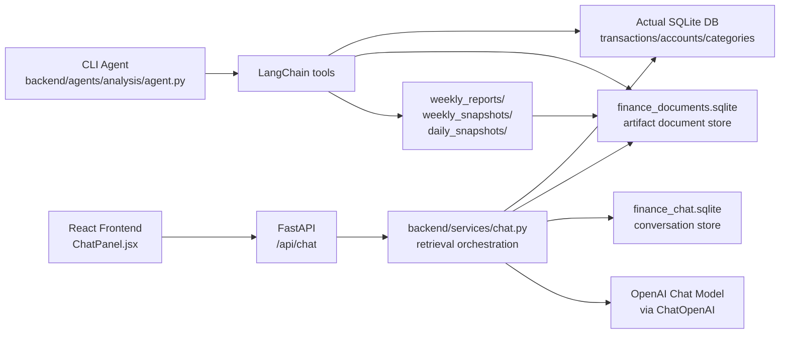

# AI Architecture Summary

This document describes the current AI functionality in the finance agent repository as of May 2026.

The codebase currently has two product-facing AI paths served by FastAPI:

- an analysis assistant for spending and historical review
- a planner assistant for budgeting workflows

They share the same finance data layer, conversation store, and some retrieval helpers, but they have different orchestration flows.

## High-Level View

```mermaid
flowchart LR
    UI["React Frontend\nChatPanel.jsx"] --> API["FastAPI\n/api/chat"]
    API --> CHAT["backend/services/chat.py\nretrieval orchestration"]
    CHAT --> LEDGER["Actual SQLite DB\ntransactions/accounts/categories"]
    CHAT --> DOCS["finance_documents.sqlite\nartifact document store"]
    CHAT --> CONV["finance_chat.sqlite\nconversation store"]
    CHAT --> LLM["OpenAI Chat Model\nvia ChatOpenAI"]

    CLI["CLI Agent\nbackend/agents/analysis/agent.py"] --> TOOLS["LangChain tools"]
    TOOLS --> LEDGER
    TOOLS --> DOCS
    TOOLS --> ARTIFACTS["weekly_reports/\nweekly_snapshots/\ndaily_snapshots/"]
    ARTIFACTS --> DOCS
```

## System Split

### 1. Analysis Assistant

The spending and historical-review assistant is the analysis path behind the floating assistant shell. The main files are:

- [frontend/src/components/ChatPanel.jsx](/Users/ketia/Documents/Actual/My-Finances-b5b9544/finance-agent/frontend/src/components/ChatPanel.jsx:1)
- [backend/app.py](/Users/ketia/Documents/Actual/My-Finances-b5b9544/finance-agent/backend/app.py:1)
- [backend/services/chat.py](/Users/ketia/Documents/Actual/My-Finances-b5b9544/finance-agent/backend/services/chat.py:1)
- [backend/agents/analysis/agent.py](/Users/ketia/Documents/Actual/My-Finances-b5b9544/finance-agent/backend/agents/analysis/agent.py:1)
- [backend/agents/analysis/context.py](/Users/ketia/Documents/Actual/My-Finances-b5b9544/finance-agent/backend/agents/analysis/context.py:1)
- [backend/agents/analysis/llm.py](/Users/ketia/Documents/Actual/My-Finances-b5b9544/finance-agent/backend/agents/analysis/llm.py:1)

This path is a grounded retrieval-and-response flow. It builds finance facts from live data and historical artifacts, then asks the model to produce a structured answer.

### 2. Planner Assistant

The budgeting assistant is the planner path. The main files are:

- [backend/services/planner_chat.py](/Users/ketia/Documents/Actual/My-Finances-b5b9544/finance-agent/backend/services/planner_chat.py:1)
- [backend/agents/planner/agent.py](/Users/ketia/Documents/Actual/My-Finances-b5b9544/finance-agent/backend/agents/planner/agent.py:1)
- [backend/agents/planner/llm.py](/Users/ketia/Documents/Actual/My-Finances-b5b9544/finance-agent/backend/agents/planner/llm.py:1)
- [backend/agents/planner/presenter.py](/Users/ketia/Documents/Actual/My-Finances-b5b9544/finance-agent/backend/agents/planner/presenter.py:1)
- [backend/mcp/tools.py](/Users/ketia/Documents/Actual/My-Finances-b5b9544/finance-agent/backend/mcp/tools.py:1)
- [backend/mcp/resources.py](/Users/ketia/Documents/Actual/My-Finances-b5b9544/finance-agent/backend/mcp/resources.py:1)

This path is a stateful turn runner over MCP-backed planner resources and tools. It supports recommendation, revision, approval, and save flows.

## Historical Retrieval Layer

The document layer lives in [backend/services/documents.py](/Users/ketia/Documents/Actual/My-Finances-b5b9544/finance-agent/backend/services/documents.py:1).

It converts generated artifacts into searchable normalized records stored in `finance_documents.sqlite`.

Current source artifact types:

- `daily_snapshots/*.json`
- `weekly_snapshots/*.json`
- `weekly_reports/*.md`

Stored document fields include:

- type
- source path
- title/content
- start/end dates
- total income/expense/net cashflow
- categories
- payees
- metadata JSON

This layer enables the analysis chat system to answer historical questions without recomputing everything from the raw ledger every time.

## Shared Data Dependencies

Both assistant paths depend on the same core data sources:

### 1. Actual Budget SQLite Database

Read through [backend/utils/db.py](/Users/ketia/Documents/Actual/My-Finances-b5b9544/finance-agent/backend/utils/db.py:1), this is the source of truth for:

- transactions
- accounts
- categories

### 2. Derived Insight Functions

The main analytic functions live in [backend/services/insights.py](/Users/ketia/Documents/Actual/My-Finances-b5b9544/finance-agent/backend/services/insights.py:1).

These functions are responsible for:

- rollups
- week-over-week comparisons
- recurring detection
- anomaly detection
- snapshot generation

### 3. Internal Transfer Filtering

Analytics calculations depend on [backend/services/filters.py](/Users/ketia/Documents/Actual/My-Finances-b5b9544/finance-agent/backend/services/filters.py:1) to exclude internal transfer categories from income/expense reporting while keeping raw ledger rows available where appropriate.

## Current Strengths

- The analysis chat is grounded in real finance facts, not only free-form model memory.
- The planner chat is bounded and safer for write-like budgeting workflows.
- Historical retrieval is local and inexpensive once artifacts are built.
- Conversations are persisted and scoped to accounts.
- The backend is now organized into analysis, planner, and shared agent packages.

## Current Architectural Limits

### Analysis Chat Is Not a Free-Form Tool Planner

The analysis chat does not currently let the model choose tools dynamically in a loop. All retrieval is assembled before the LLM call.

### Retrieval Is Mostly Heuristic

Specialized retrieval is triggered by simple keyword checks and context cues. This is easy to maintain, but brittle for broader language variation.

### Planner and Analysis Still Have Different Internal Complexity

They now share a cleaner package structure, but the planner path is still much more stateful than the analysis path.

## Recommended Mental Model

- the analysis assistant is a grounded finance Q&A service over live data plus historical artifacts
- the planner assistant is a stateful budgeting workflow over MCP resources and tools
- the document store is the bridge that gives analysis historical memory
