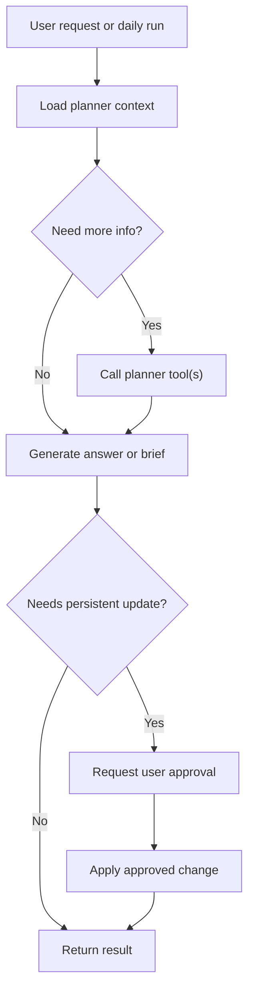

# Agent Flow Intro

This document is a beginner-friendly introduction to the future agent flow for the finance planner.

If you are new to agentic systems, the most important lesson is:

- an agent is not just "LLM with more prompt"

An agent is a system that:

- has access to structured capabilities
- decides what information it needs
- may call tools
- works within a stateful workflow
- often hands control back to the user for approval

## Current System vs Target System

### Current Product Chat

Today the frontend chat mostly works like this:

1. backend assembles a retrieval pack
2. backend sends facts to the model
3. model writes an answer

This is good for Q&A.

### Target Planner Agent

The planner agent should work more like this:

1. inspect current planner state
2. decide what additional information is needed
3. call planner tools when necessary
4. generate a recommendation or explanation
5. ask for approval before persistent changes
6. record the outcome

That is the beginning of an agentic workflow.

## Core Agent Pattern

The planner agent should follow a pattern like:

## What The Agent Should Own

The agent should own:

- deciding what to inspect
- deciding whether tool calls are needed
- synthesizing user-facing explanations
- generating recommendations
- preparing proposed changes

## What The Agent Should Not Own

The agent should not own:

- transaction math
- budget calculations
- forecasting logic
- recommendation scoring rules
- planner state persistence rules

Those should stay deterministic in backend code.

## Good First Agent Flows

The planner does not need every flow on day one.

Good early flows are:

### 1. Monthly Review

- load current budget state
- load drift report
- load current goals
- summarize status
- suggest top next action

### 2. Large Purchase Check

- load portfolio summary
- load budget status
- forecast month end
- create temporary scenario
- explain whether purchase is safe

### 3. Overspend Recovery

- load at-risk categories
- get adjustment options
- explain tradeoffs
- propose rebalance
- wait for approval

### 4. Daily Brief

- load latest monitoring snapshot
- load open recommendations
- generate concise daily brief

## Approval Checkpoints

Approval checkpoints are one of the most important production ideas in agentic systems.

The assistant can:

- recommend
- draft
- simulate
- summarize

The user should approve:

- budget changes
- goal changes
- exception markers
- plan adoption

This keeps the assistant useful without making it unsafe or unpredictable.

## Why MCP Helps The Agent

Without MCP or a similar interface, the agent often ends up tightly coupled to app internals.

With MCP:

- resources give it planner state
- tools give it planner actions
- prompts give it guided workflows

This makes the agent easier to reason about and easier to evolve.

## Main Learning Model

When building this system, think in this order:

1. What is the deterministic finance truth?
2. What should be exposed as state?
3. What should be exposed as tools?
4. Where does the agent help interpret or guide?
5. Where must the user approve?

If you keep those questions separate, the architecture will stay clean.
