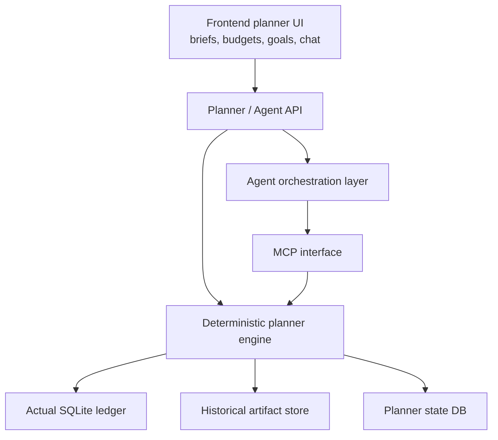

# Planner Architecture

This document describes the target architecture for evolving the current finance Q&A system into a portfolio-wide finance planner assistant.

The goal is to move from:

- question -> retrieval pack -> model answer

to:

- planner state -> deterministic finance computation -> agent reasoning -> user approval -> persistent plan updates

## Product Goal

The future assistant should:

- reason across all cards and accounts by default
- track budgets and goals over time
- monitor financial status daily
- forecast likely outcomes before month-end
- recommend changes when the user is off track
- ask for approval before applying persistent changes

This is a different product shape from the current chat feature. It is not only a smarter chatbot. It is a planner system with an assistant interface on top.

## Architectural Layers

## Layer Responsibilities

### 1. Ledger Layer

The ledger layer is the source of truth for transaction and account history.

Existing reusable sources:

- `backend/utils/db.py`
- `backend/services/filters.py`
- `backend/services/insights.py`

This layer should remain deterministic and testable.

### 2. Planner State Layer

This is new.

The planner needs structured state beyond chat history, including:

- budget plans
- budget targets by category
- savings and debt goals
- planner preferences
- daily planner snapshots
- recommendations and their statuses
- scenarios
- exception markers

This layer makes the assistant longitudinal instead of request-only.

### 3. Deterministic Planner Engine

This layer computes finance truths such as:

- portfolio summary
- budget status
- category pacing
- month-end forecasts
- safe-to-spend estimates
- goal progress
- recommendation candidates

Important principle:

- finance math belongs here, not in the LLM prompt

### 4. MCP Interface

The MCP layer exposes planner capabilities as:

- resources for stable planner state
- tools for targeted computations or updates
- prompts for guided workflows

The agent should consume this interface rather than raw implementation details.

### 5. Agent Layer

The agent is responsible for:

- inspecting planner state
- deciding when to use planner tools
- generating explanations and recommendations
- preparing changes for approval

The agent should not own budget math or forecasting logic.

### 6. UI Layer

The UI should expose planner state through more than chat alone.

Likely surfaces:

- daily brief
- budget status
- recommendations
- goals
- scenarios
- portfolio chat

## Portfolio-First Context

The planner should think in terms of the whole financial system by default.

Current chat is card-first. The target planner should be:

- portfolio-first by default
- account/card drilldown when needed

This changes how both tools and UI are structured.

## Daily Monitoring Loop

The assistant should not wait for a user question to compute financial status.

Target daily flow:

1. Read latest ledger state.
2. Compute planner snapshot.
3. Compute budget and goal status.
4. Generate recommendation candidates.
5. Persist snapshot and recommendations.
6. Generate a concise planner brief for the UI.

This is how the system becomes assistant-like rather than only reactive.

## Approval Boundary

The planner should be allowed to:

- observe
- summarize
- forecast
- recommend
- create temporary scenarios

The planner should not silently:

- update persistent budgets
- create or modify goals
- change planner preferences
- mark long-lived exceptions

Persistent actions should require user approval.

## Build Order

The target system should be built in this order:

1. planner state database
2. deterministic planner services
3. planner API and UI
4. MCP resources and tools
5. agent orchestration
6. daily monitoring jobs

This order keeps the finance truth layer stable before adding agentic behavior.

## Key Design Principles

- deterministic finance computation first
- portfolio-first scope by default
- approval-gated writes
- chat is one interface, not the whole planner
- MCP is an interface layer, not the planner itself
- the agent interprets and guides, but does not invent finance math
